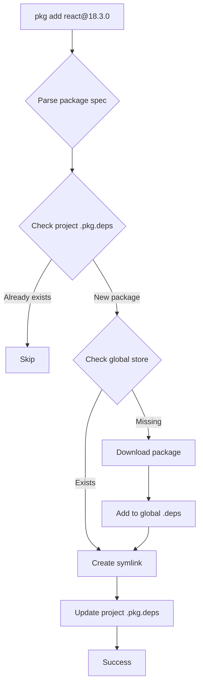
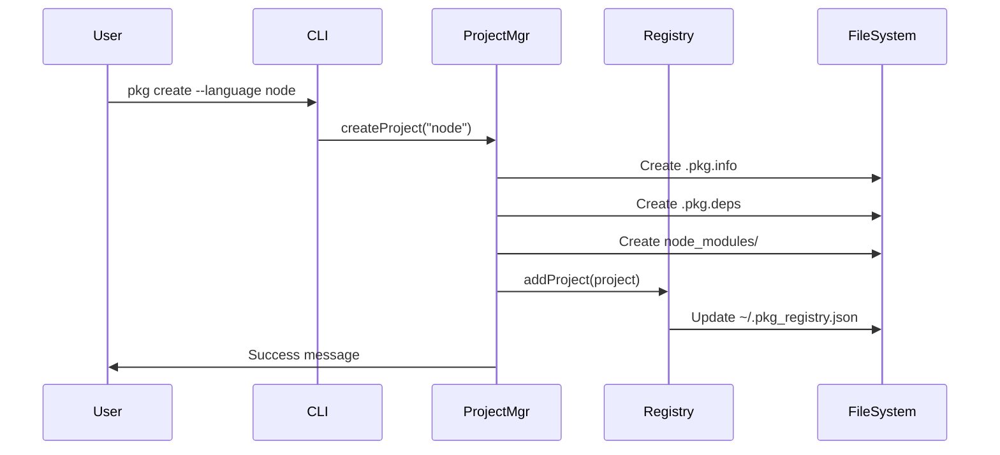
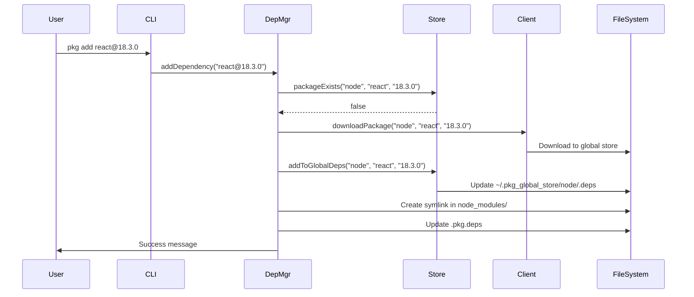

# PKG Architecture Documentation

## Overview

PKG is a universal package manager written in C++ that provides unified dependency management across multiple programming languages. It uses a global store architecture with symlink-based project dependencies for efficient storage and fast operations.

## Core Components

### 1. GlobalRegistry

**Purpose**: Manages the global project registry stored at `~/.pkg_registry.json`.

**Responsibilities**:

- CRUD operations for projects
- Unique project ID generation
- Fuzzy search across project names, descriptions, and tags
- JSON persistence

**Key Methods**:

- `addProject()` - Register a new project
- `getProject()` - Retrieve project by name or ID
- `searchProjects()` - Fuzzy search with scoring
- `getAllProjects()` - List all registered projects

### 2. GlobalStore

**Purpose**: Manages the global package store at `~/.pkg_global_store/`.

**Responsibilities**:

- Language-specific folder organization
- Global `.deps` file management per language
- Package version tracking
- Storage path resolution

**Directory Structure**:

```
~/.pkg_global_store/
├─ node/
│  ├─ node_modules/
│  │  ├─ <package>/<version>/
│  ├─ .deps
├─ python/
│  ├─ site-packages/
│  ├─ .deps
```

**Key Methods**:

- `packageExists()` - Check if package version exists
- `getPackagePath()` - Resolve path to package
- `addToGlobalDeps()` - Update global `.deps` file
- `getGlobalDeps()` - Read global dependencies

### 3. ProjectManager

**Purpose**: Handles project lifecycle operations.

**Responsibilities**:

- Project creation and initialization
- `.pkg.info` and `.pkg.deps` file management
- Editor configuration
- Project search and listing

**Project Files**:

**.pkg.info** (JSON):

```json
{
  "id": "proj-abc123",
  "name": "my-app",
  "path": "/home/user/my-app",
  "language": "node",
  "default_dep_folder": "node_modules",
  "created_at": "2025-12-24T00:00:00Z",
  "default_editor": "code"
}
```

**.pkg.deps** (JSON):

```json
{
  "react": "18.3.0",
  "fastify": "4.27.0"
}
```

**Key Methods**:

- `createProject()` - Create new project
- `initProject()` - Initialize existing directory
- `openProject()` - Open in configured editor
- `setEditor()` / `unsetEditor()` - Configure editor

### 4. DependencyManager

**Purpose**: Manages project and global dependencies.

**Responsibilities**:

- Package installation and removal
- Version resolution (latest vs. specified)
- Symlink creation and management
- Dependency listing

**Workflow for Adding a Dependency**:



**Key Methods**:

- `addDependency()` - Install package
- `removeDependency()` - Remove package
- `updateDependency()` - Update to new version
- `listProjectDeps()` - List project dependencies
- `listGlobalDeps()` - List global dependencies

### 5. RegistryClient

**Purpose**: HTTP client for querying package registries.

**Responsibilities**:

- Query npm, PyPI, RubyGems, Maven, Go registries
- Fetch latest version information
- Download package tarballs

**Registry URLs**:

- Node.js: `https://registry.npmjs.org`
- Python: `https://pypi.org/pypi`
- Ruby: `https://rubygems.org/api/v1`
- Java: `https://search.maven.org/solrsearch/select`
- Go: `https://proxy.golang.org`

**Key Methods**:

- `getLatestVersion()` - Query latest version
- `downloadPackage()` - Download package files
- Language-specific implementations for each registry

### 6. CLI

**Purpose**: Command-line interface parser and router.

**Responsibilities**:

- Parse command-line arguments
- Route to appropriate manager methods
- Display help and usage information
- Handle command aliases

**Command Structure**:

```
pkg <command> [subcommand] [options] [args]
```

## Data Flow

### Creating a Project



### Adding a Dependency



## Symlink Strategy

PKG uses symbolic links to connect project dependency folders to the global store:

**Advantages**:

- Minimal disk usage (packages stored once)
- Fast updates (just change symlink target)
- Consistent with language-native tools
- Easy cleanup (remove symlink, not entire package)

**Implementation**:

- Unix/Linux/macOS: Standard `symlink()` system call
- Windows: `CreateSymbolicLink()` with junction points for directories

**Example**:

```
Project: /home/user/my-app/node_modules/react
  -> ~/.pkg_global_store/node/node_modules/react/18.3.0
```

## File Formats

### Global Registry (`~/.pkg_registry.json`)

```json
{
  "version": "1.0.0",
  "projects": [
    {
      "id": "proj-abc123",
      "name": "my-app",
      "path": "/home/user/my-app",
      "language": "node",
      "default_dep_folder": "node_modules",
      "created_at": "2025-12-24T00:00:00Z",
      "default_editor": "code",
      "tags": ["web", "frontend"],
      "description": "My awesome app"
    }
  ]
}
```

### Global .deps (`~/.pkg_global_store/<language>/.deps`)

```json
{
  "react": "18.3.0",
  "fastify": "4.27.0",
  "express": "4.18.2"
}
```

### Project .pkg.info

See ProjectManager section above.

### Project .pkg.deps

See ProjectManager section above.

## Language Support

PKG supports multiple languages through a configurable mapping:

```cpp
map<string, string> languageDepFolders = {
    {"node", "node_modules"},
    {"python", "site-packages"},
    {"ruby", "gems"},
    {"java", "maven"},
    {"go", "pkg"}
};
```

Adding a new language requires:

1. Add entry to `languageDepFolders` map
2. Implement registry client methods
3. Update documentation

## Error Handling

- All operations return boolean success/failure
- Errors logged with colored output (red for errors, yellow for warnings)
- JSON parsing wrapped in try-catch blocks
- File operations checked for success
- User confirmation for destructive operations (delete)

## Cross-Platform Considerations

### Filesystem Paths

- Use `/` as separator internally
- Convert to platform-specific separator when needed
- Handle Windows drive letters

### Symlinks

- Unix: Standard symbolic links
- Windows: Requires admin privileges or Developer Mode
- Fallback: Copy files if symlinks fail (future enhancement)

### Home Directory

- Unix: `$HOME`
- Windows: `%USERPROFILE%`

## Performance Optimizations

1. **Lazy Loading**: Registry and store data loaded on demand
2. **Caching**: In-memory cache of frequently accessed data
3. **Parallel Downloads**: Future enhancement for multiple packages
4. **Incremental Updates**: Only update changed files

## Security Considerations

1. **Path Validation**: Prevent directory traversal attacks
2. **HTTPS Only**: All registry queries use HTTPS
3. **Checksum Verification**: Future enhancement for package integrity
4. **Sandboxing**: Future enhancement for package installation

## Future Enhancements

1. **Lock Files**: Deterministic dependency resolution
2. **Workspaces**: Monorepo support
3. **Scripts**: Pre/post install hooks
4. **Plugins**: Extensible architecture
5. **Cache Management**: Automatic cleanup of unused packages
6. **Offline Mode**: Work without internet connection
7. **Dependency Graph**: Visualize dependencies
8. **Version Constraints**: Semantic versioning support
